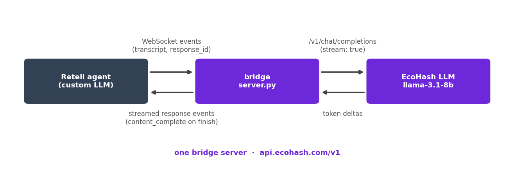

# Retell AI + EcoHash: custom LLM bridge

Retell's custom LLM slot opens a WebSocket to your server during a call, streams the live transcript, and speaks whatever text you stream back. This bridge answers with streaming completions from an open model on EcoHash, so the agent's brain costs tokens instead of Retell's per-minute LLM fee.



1. Your server sends a config event and a first sentence to speak.
2. When the caller finishes a turn, Retell sends `response_required` with the live transcript and a `response_id`.
3. The bridge forwards the transcript to EcoHash `/v1/chat/completions` with `stream: true`.
4. Each token delta goes back as a response event; a final `content_complete` closes the turn. A newer `response_id` supersedes any reply still streaming.

## Run

```bash
pip install fastapi uvicorn openai
export ECOHASH_API_KEY=eco_...   # create one at console.ecohash.com
uvicorn server:app --host 0.0.0.0 --port 8000
```

Expose the port publicly (ngrok is fine for a first test).

## Point the agent at it

In the Retell dashboard, pick **Custom LLM** as the agent's response engine and set the URL:

```
wss://your-host.example.com/llm-websocket
```

Retell appends the call id and connects when a call starts. Voice, transcriber, and phone number stay as they were.

## Test it without making a call

```bash
pip install websockets
python3 - <<'EOF'
import asyncio, json, websockets

async def main():
    async with websockets.connect("ws://localhost:8000/llm-websocket/test-1") as ws:
        print(json.loads(await ws.recv()))             # config
        print(json.loads(await ws.recv())["content"])  # first sentence
        await ws.send(json.dumps({
            "interaction_type": "response_required", "response_id": 1,
            "transcript": [{"role": "user", "content": "Do you deliver on weekends?"}]}))
        reply = ""
        while True:
            ev = json.loads(await ws.recv())
            reply += ev.get("content", "")
            if ev.get("content_complete"):
                break
        print(reply)

asyncio.run(main())
EOF
```

We ran this loop while writing the integration: config handshake, first sentence, and a coherent streamed reply from `llama-3.1-8b-instruct`, with ping and interrupt handling working as documented.

## Notes

- The custom LLM slot covers the brain only: Retell's STT and TTS stay on its built-in providers. For an open TTS slot, see the [Vapi integration](../vapi).
- Keep replies short for voice; the system prompt in `server.py` already pushes for one-sentence answers.
- Swap `ECOHASH_MODEL` for any chat model on EcoHash: https://ecohash.com/models
- Cost math against Retell's per-minute LLM fees and the FAQ are in the tutorial: https://ecohash.com/blog/retell-custom-llm
