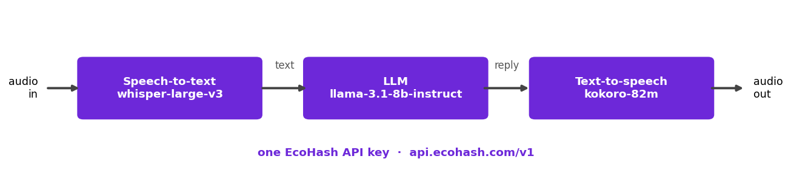

# Voice agent

A voice agent built on three EcoHash endpoints with **one API key**:
speech-to-text (`whisper-large-v3`) → LLM (`llama-3.1-8b-instruct`) → text-to-speech (`kokoro-82m`).



**How it works:** transcribe the user's audio → send the text (with conversation
history) to the LLM → synthesize the reply to a `.wav`. History is kept within a run,
so it is multi-turn.

## Run

```bash
pip install openai
export ECOHASH_API_KEY=eco_...   # create one at console.ecohash.com

python agent.py input.wav        # transcribe a file, reply, write reply.wav
python agent.py --mic            # record from the mic each turn (pip install sounddevice numpy)
```

**Expected output:** prints the transcript and the reply, and writes `reply.wav`.

Unlike setups that need one vendor for STT and another for TTS, EcoHash serves the
whole pipeline behind a single key.

**Latency note:** these are separate request/response calls, not a streaming real-time
agent — a streaming version is a natural next step. Measured TTFA/RTFx are in our
[speech benchmarks](https://github.com/ecohash-ai/ecohash-benchmarks).

**Docs:** [Speech-to-text](https://docs.ecohash.com/platform-models/audio-transcription) · [Text-to-speech](https://docs.ecohash.com/platform-models/audio-speech) · [Chat](https://docs.ecohash.com/platform-models/chat-completions)
