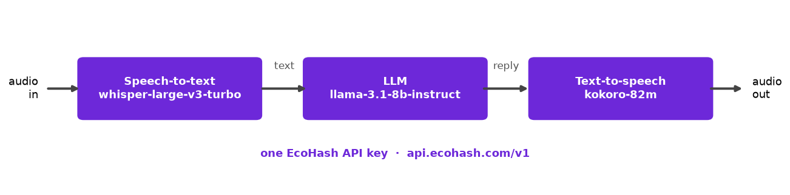

# Voice agent

A voice agent built on three EcoHash endpoints with one API key:
speech-to-text (`whisper-large-v3-turbo`), LLM (`llama-3.1-8b-instruct`),
text-to-speech (`kokoro-82m`).



**How it works:** transcribe the user's audio, send the text with conversation history
to the LLM, synthesize the reply to a `.wav`. History is kept within a run, so it is
multi-turn.

## Run

```bash
pip install openai
export ECOHASH_API_KEY=eco_...   # create one at https://console.ecohash.com?utm_source=github\&utm_medium=referral\&utm_campaign=devrel&utm_content=examples-voice-agent

python agent.py input.wav        # transcribe a file, reply, write reply.wav
python agent.py --mic            # record from the mic each turn (pip install sounddevice numpy)
```

**Expected output:** the transcript, the reply, and a `reply.wav` on disk.

```
You: EcoHash provides an OpenAI-compatible API for open models.
Assistant: That's correct! EcoHash offers an OpenAI-compatible API for open models,
allowing developers to access and integrate various AI models with ease.
Wrote reply.wav
```

Need a test file? [quickstart/speech-to-text](../quickstart/speech-to-text) shows how
to make one in two commands on macOS.

One key covers all three stages, so there is no second vendor to sign up with for the
speech half of the pipeline.

**Latency note:** these are separate request and response calls, not a streaming
real-time agent. A streaming version is a natural next step. Measured TTFA and RTFx
are in our [speech benchmarks](https://github.com/ecohash-ai/ecohash-benchmarks).

**Docs:** [Speech-to-text](https://docs.ecohash.com/platform-models/audio-transcription?utm_source=github\&utm_medium=referral\&utm_campaign=devrel&utm_content=examples-voice-agent-stt-docs) ·
[Text-to-speech](https://docs.ecohash.com/platform-models/audio-speech?utm_source=github\&utm_medium=referral\&utm_campaign=devrel&utm_content=examples-voice-agent-tts-docs) ·
[Chat](https://docs.ecohash.com/platform-models/chat-completions?utm_source=github\&utm_medium=referral\&utm_campaign=devrel&utm_content=examples-voice-agent-chat-docs)
